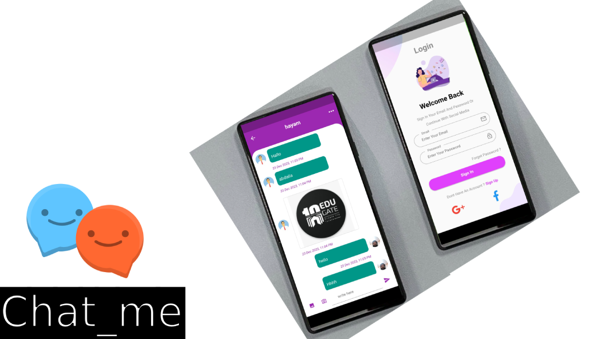

# Chat_me App

This is a modern Flutter-based messaging app where users can register and log in to chat with their friends and family.

This application uses status management (get x).

It uses Firebase Cloud Firestore in addition to Firebase Authentication and secure authentication methods.

One of the first simple apps I built during my Flutter learning journey.

### Screenshots

  &nbsp;&nbsp;&nbsp;&nbsp;&nbsp;&nbsp;&nbsp;&nbsp;&nbsp;&nbsp;&nbsp;&nbsp;&nbsp;&nbsp;&nbsp;&nbsp;&nbsp;&nbsp;&nbsp;&nbsp;&nbsp;&nbsp;&nbsp;&nbsp;&nbsp;
  
  
### Dependencies

 1. get: ^4.6.5

 2. firebase_core: ^2.17.0
  
 3. cloud_firestore: ^4.9.3

 4. firebase_storage: ^11.2.8

 5. firebase_messaging: ^14.6.9

 6. firebase_auth: ^4.10.1

 7. google_sign_in: ^6.1.5

 8. image_picker: ^1.0.4

 9. flutter_svg: ^1.1.0

## Tasks and Features

* Improve the UI
* Implementing the App with Features
* Login Page using Google
* Upon authentication, a verification link is sent via email and then you have access
* Possibility of uploading photos or audio recording
* Database integration with  Firebase

##### Made with ♥ by Abdalla Elenany

